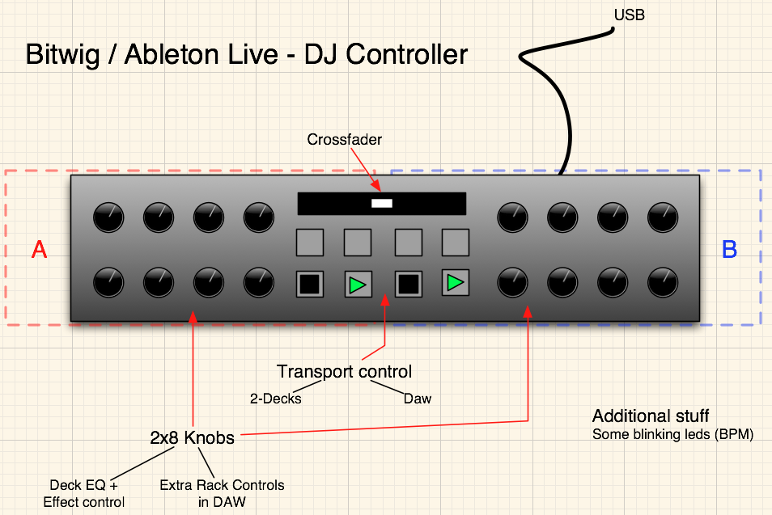
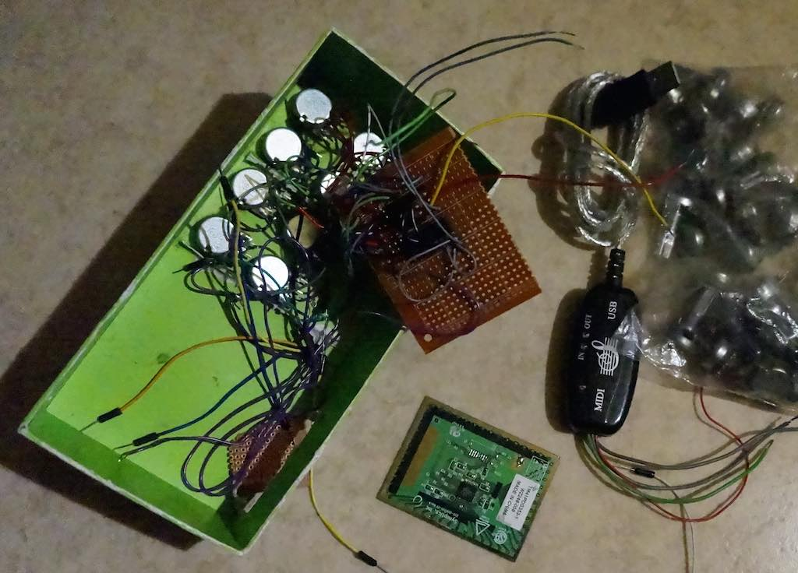

Ideas, notes and some code for an ideal minimal dj midi controller.

## Concept sketch 1

## Prototype from 2014

A semi working build for related `sketch.ino` arduino source code file. This one replaces the second 8-knob area with a Synaptics laptop touchpad that would be used as XY-controller (there's some notes for it's usage in the subdirectory). Strongly influenced by [The 5$ Karduinoss pad (by buZztiaan)](http://www.instructables.com/id/The-5-Karduinoss-pad/?ALLSTEPS).

